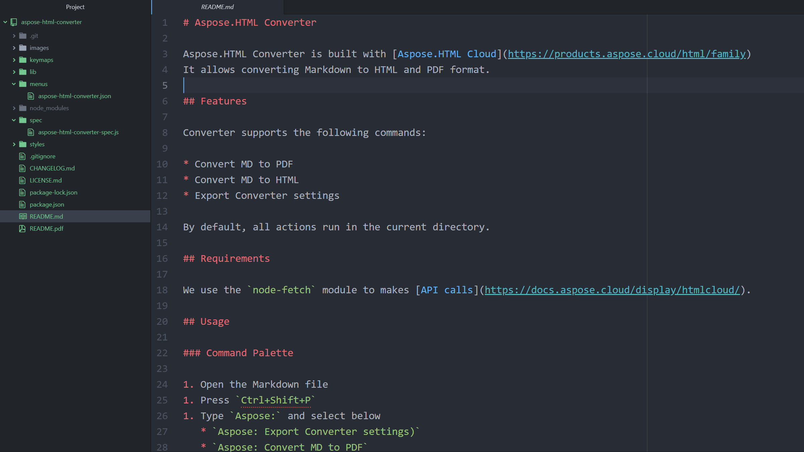
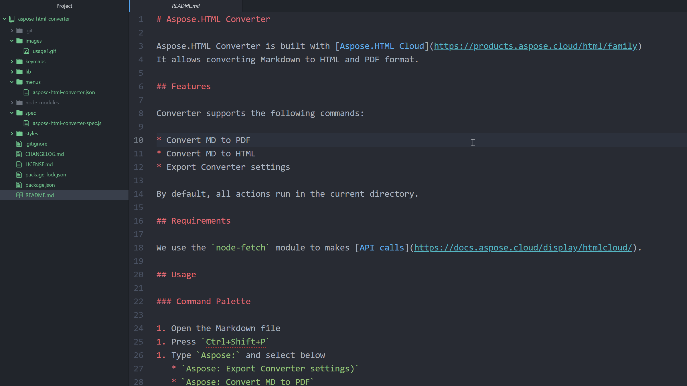

# Aspose Cloud for Atom

Aspose Cloud for Atom is built with [aspose.cloud](https://www.aspose.cloud/)
It allows converting Markdown to HTML and PDF format.

## Features

Converter supports the following commands:

* Convert MD to PDF
* Convert MD to HTML
* Export Converter settings

By default, all actions run in the current directory.

## Requirements

We use the `node-fetch` module to make [API calls](https://docs.aspose.cloud/display/htmlcloud/).

## Usage

### Command Palette

1. Open the Markdown file
1. Press `Ctrl+Shift+P`
1. Type `Aspose:` and select below
   * `Aspose: Export Converter settings)`
   * `Aspose: Convert MD to PDF`
   * `Aspose: Convert MD to HTML`

### Menu

1. Open the Markdown file
1. Right click and select below
   * `Aspose: Convert MD to PDF`
   * `Aspose: Convert MD to HTML`

## Extension Settings

Markdown Converter contributes the following settings:

* `outputDirectory`: Location for output files. Default is `.` (current).
* `paper.orientation`: Paper orientation for PDF files. Accepted values `Portrait` or `Landscape`.
* `paper.size`: Paper Size [`A0`, `A1`, `A2`, `A3`, `A4`, `A5`, `A6`, `Letter`, `Legal`]. The value `Custom` means using options `Width` and `Height` instead Paper Size.
* `paper.width`: Paper Width, accepts values labeled with units(mm, cm, in, px).
* `paper.height`: Paper Height, accepts values labeled with units(mm, cm, in, px).
* `margin.top`: Top margin (units: mm, cm, in, px).
* `margin.bottom`: Bottom margin (units: mm, cm, in, px).
* `margin.right`: Right margin (units: mm, cm, in, px).
* `margin.left`: Left margin (units: mm, cm, in, px)."

## Known Issues

* MD-to-PDF conversion: The `@page` CSS at-rule can be applied incorrectly.

## Workflow

In order to make changes in the repository, you need to:

1. Create a branch with the proposed changes whose name matches the feature/* pattern.
2. Create a pull request for this branch. It will be automatically assigned to a suitable reviewer.
3. Once the request is approved, it can be merged.
